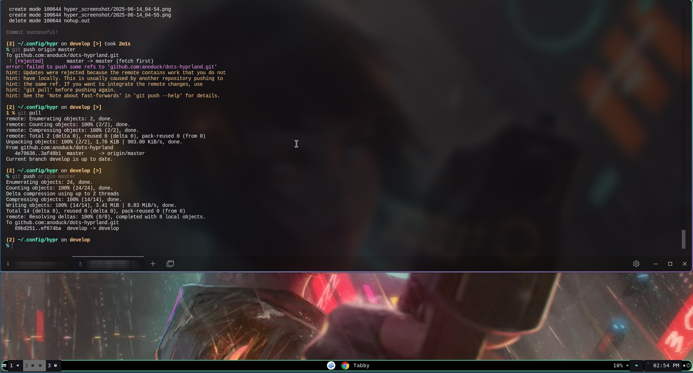
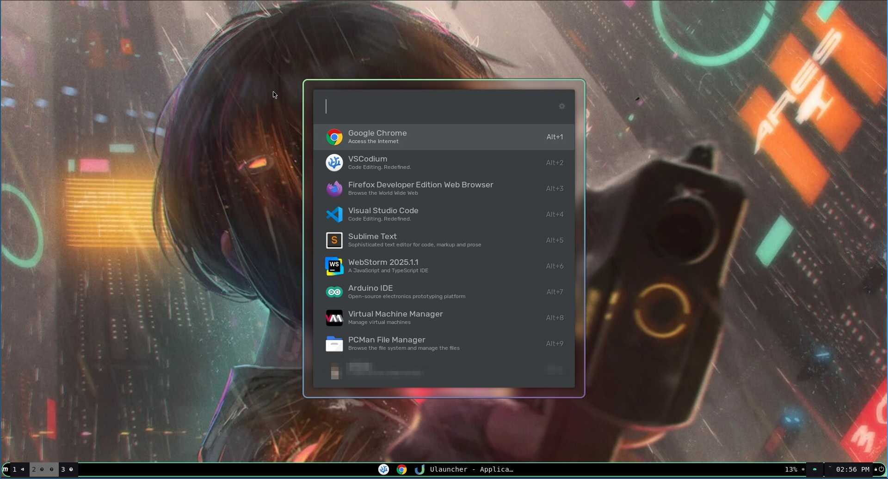
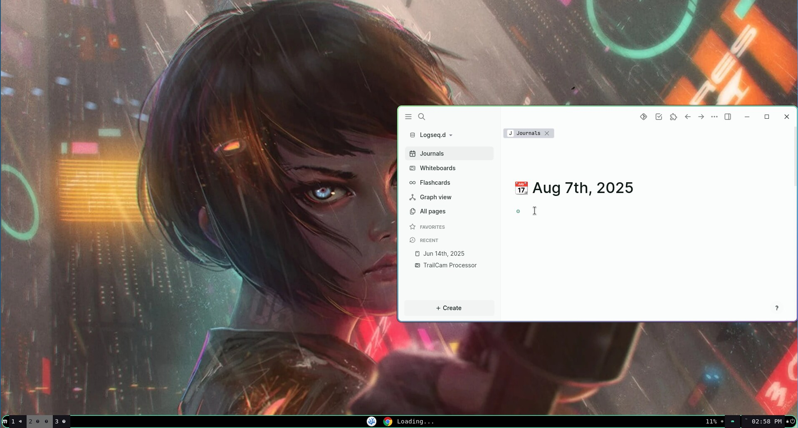

<pre>
 █████   █████                                ████                           █████
░░███   ░░███                                ░░███                          ░░███
 ░███    ░███  █████ ████ ████████  ████████  ░███   ██████   ████████    ███████
 ░███████████ ░░███ ░███ ░░███░░███░░███░░███ ░███  ░░░░░███ ░░███░░███  ███░░███
 ░███░░░░░███  ░███ ░███  ░███ ░███ ░███ ░░░  ░███   ███████  ░███ ░███ ░███ ░███
 ░███    ░███  ░███ ░███  ░███ ░███ ░███      ░███  ███░░███  ░███ ░███ ░███ ░███
 █████   █████ ░░███████  ░███████  █████     █████░░████████ ████ █████░░████████
░░░░░   ░░░░░   ░░░░░███  ░███░░░  ░░░░░     ░░░░░  ░░░░░░░░ ░░░░ ░░░░░  ░░░░░░░░
                ███ ░███  ░███
               ░░██████   █████
                ░░░░░░   ░░░░░
 ██████████             █████       ██████   ███  ████
░░███░░░░███           ░░███       ███░░███ ░░░  ░░███
 ░███   ░░███  ██████  ███████    ░███ ░░░  ████  ░███   ██████   █████
 ░███    ░███ ███░░███░░░███░    ███████   ░░███  ░███  ███░░███ ███░░
 ░███    ░███░███ ░███  ░███    ░░░███░     ░███  ░███ ░███████ ░░█████
 ░███    ███ ░███ ░███  ░███ ███  ░███      ░███  ░███ ░███░░░   ░░░░███
 ██████████  ░░██████   ░░█████   █████     █████ █████░░██████  ██████
░░░░░░░░░░    ░░░░░░     ░░░░░   ░░░░░     ░░░░░ ░░░░░  ░░░░░░  ░░░░░░

</pre>

# Hyprland Dotfiles

A reasonable Hyprland configuration for reasonable people with reasonable expectations, who believe that form should always follow function. Not, the other way around.

>Rice is full of carbs, and makes everything bloated and fat. What we want is the meat, high protein, preferrably with cheese.

## Explanation

Almost an entire month after installing a rice configuration, I still found myself
discovering "surprises" in my system. Although, the rice was beautiful and the developer
obviously went to much trouble to make it, he did not put forth any effort to explain what
was going to be installed and how to uninstall it.

## Examples

| Screenshots                         | Screenshots                      |
|-------------------------------------|----------------------------------|
|  |  |
|         |                              |

## Getting Started

Below is where you can find instructions on how to get this particular Hyprland configuration up and running. Applications used were selected based on availability and ease of installation.

See deployment for notes on deploying the project on a live system.

### Prerequisites

Here is what you will need to get things up and running:
- Hyprland
- Rofi
- hyprpaper
- waybar

### Installing

A step by step series of examples that tell you how to get a development
environment running

First off, clone the repository locally into your XDG configuration directory.

    git clone https://github.com/anoduck/hyprland-dotfiles ~/.config/hypr

And repeat

    Hyprland

End with an example of getting some data out of the system or using it
for a little demo

## Deployment

Add additional notes to deploy this on a live system

## Built With

This configuration was built with the following applications provided by the Open Source Community.

- [Hyprland]( )
- [Hyprpaper]( )
- [Tabby Terminal](https://tabby.sh)
- [Pyprland]( )
- [Eww]( )
- [Rofi]( )
- [waybar]( )

## Contributing

If you notice a bug, or discover something was left out. Open up an issue, and if desired pull requests are welcome.

## Versioning

We use [Semantic Versioning](http://semver.org/) for versioning. For the versions
available, see the [tags on this
repository](https://github.com/PurpleBooth/a-good-readme-template/tags).

## Authors

See also the list of
[contributors](https://github.com/PurpleBooth/a-good-readme-template/contributors)
who participated in this project.

- **Billie Thompson** - _Provided README Template_ - [PurpleBooth](https://github.com/PurpleBooth)
- **Shaan Khan** - _Provided Created README Generator_ - [Shaan Khan](https://github.com/ShaanCoding)

## License

This project is licensed under the [CC0 1.0 Universal](LICENSE.md)
Creative Commons License - see the [LICENSE.md](LICENSE.md) file for
details

## Acknowledgments

- Hat tip to anyone whose code is used
- Inspiration
- etc
